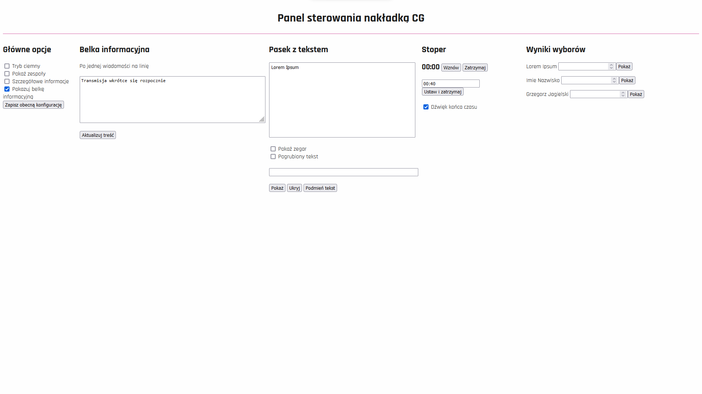
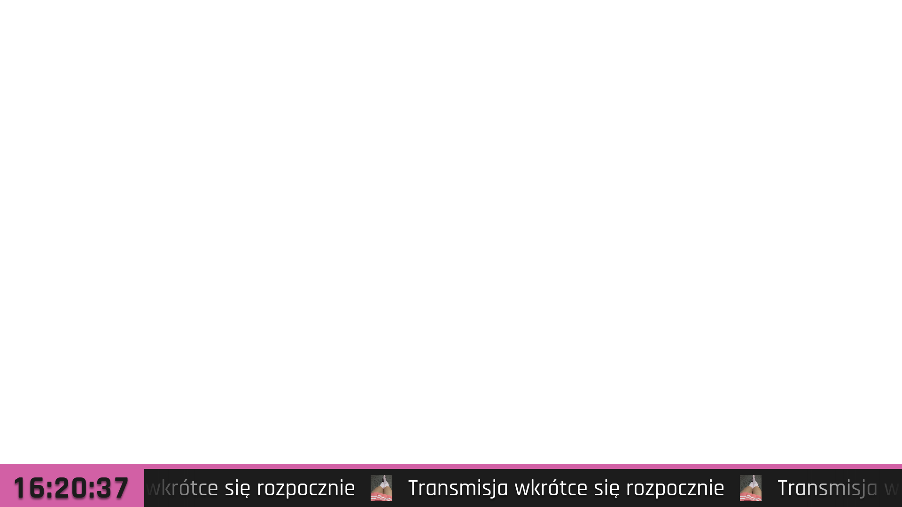
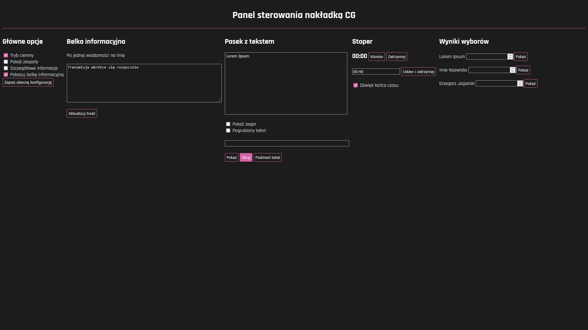

# Overlay
Overlay for ALO PWr streams


**If something is missing here, please see [OBS config repository]() for additional information.**

## Table of contents
* [Introduction](#introduction)
* [Installation](#installation)
* [Endpoints](#endpoints)
* [API Reference](#api-reference)
* [Redis Variablees](#redis-variables)

## Introduction

Originally this was backend server for ALO PWr Stream overlay for online events.
You can see how it worked live [here](https://www.youtube.com/@PolitechnikJunior).  
However to make it possible to make code public I had to replace, and get rid of few objects,
and I used this possibility to make small changes to graphic design, to make it look more... mine :3.  
No major code changes were made, except for the dark mode implementation.

Due to the aforementioned reasons history of the project was stripped to only most recent commits,
and multiple static files were removed from the historical commits, in attempt to make code publishable online,
that's why historical versions of this repository may not work/build.

**Original design of the overlay by Łukasz Świszcz**

Basic overlay functionality contains:
* Infobar with dynamic text (multiple lines supported)
* Pop-up bar for name/surname of person speaking (or similar)
* Countdown clock, visible with pop-up bar

Additionally, overlay has modes for:
* tournaments - with team headers
* elections - with bar graph, described further below

### Screenshots
#### Light mode

> Overlay itself in a light mode the white part is transparent


> Results graph in a light mode with animated bars and bg


> Control Panel in a light mode 

#### Dark mode

> Overlay itself in a dark mode the white part above the bar is transparent


> Results graph in a dark mode with animated bars and bg


> Control Panel in a dark mode 

## Installation
1. Install [docker](https://www.docker.com/), make sure that [compose](https://docs.docker.com/compose/) have been installed:
   * For Windows install [docker desktop utility](https://www.docker.com/products/docker-desktop/) from official site
   * For Linux distributions install from your desired repository, such as:
     * [AUR](https://archlinux.org/packages/extra/x86_64/docker/) 
     * [apt](https://docs.docker.com/engine/install/debian/)
     * [dnf](https://docs.docker.com/engine/install/fedora/)
2. Download zipped `overlay` folder, or whole repository, and extract it
3. Open your command line utility in freshly extracted `overlay` folder 
4. Execute command `docker compose build -t overlay`
5. Execute command `docker compose start overlay` - your overlay should be running


### Deamonizing overlay instance
**THIS IS FOR LINUX USERS ONLY**  

Waiting for missing deamon files, if you want to do it yourself refer to [systemd](https://access.redhat.com/documentation/en-us/red_hat_enterprise_linux/7/html/system_administrators_guide/chap-managing_services_with_systemd) or [init](https://unix.stackexchange.com/questions/29712/make-daemon-start-up-with-linux#29714) guide

## Endpoints

* `/` - Start page with basic configuration and information on upcoming stream

    Possible states are:
  * *"GP"* - for general purpose
  * *"Wybory"* - for voting system - generates vote count page using data from candidates
  * *"Turniej"* - Takes additional data - names of two teams, and prepares additional toggleable headers

* `/overlay` - page containing overlay to be shown in OBS
* `/controller` - control page from where all elements of overlay can be tweaked in real time
* `/results` - if *"Wybory"* was chosen as overlay mode bar graph can be accessed here
  
    Few additional information on a bar graph:
  * Its labels and number of bars are generated based of file `candidates.txt`
  * Percentage is calculated based of number of voters rather than number of students, so
  * All fields in `/controller` must be filled before any of the bars are shown, or the heights of bars won't calculate correctly

----

## API Reference

### Websocket events

#### Timer events
There are 3 kinds of events, which are labeled as `timer`.
None of those events is responsible for showing the timer, it may be running invisible in background
* Start event:
  **Example payload**:
  ```json
  {
   "event": "timer",
   "type": "start"
  }
  ```
  Simple event starting up the timer
  
* Stop event:
    **Example payload:**
    ```json
    {
     "event": "timer",
     "type": "stop"
    }
    ```
    Pauses the timer, *does not kill it*, and updates it state stored in redis

* Set event:
    **Example payload:**
    ```json
    {
     "event": "timer",
     "type": "set",
     "time": 40
    }
    ```
    Sets current countdown time on the timer to the value specified in `time` field in seconds (in example: 40 seconds)

* `timer_state` event
      
    All those events yield another response sent from server to all clients, called timer state event. This event is used to sync timer across all running clients
    **Example payload:**
    ```json
    {
     "event": "timer_state",
     "state": {
             "running": true,
             "time": 40,
             "startedAt": "2023-06-29T01:21:43661Z"
            }
    }
  ```

#### Setup event
This event is sent once by the `/` page, once setup is finished it contains only basic data about session. Teams may be null or "NA" if not provided by user. Mode can be either: *"GP", "Wybory"* or *"Turniej"*

Unlike the others this event does not yield any response to clients connected to session.

##### Example payload:
```json
{
 "event": "setup_system",
 "mode": "Turniej",
 "teams": ["TeamOne", "TeamTwo"]
}
```

#### Show Emblem
This event is responsible for visiblity of overlay header.

##### Example payload:
```json
{
 "event": "show_emblem",
 "value": true
}
```

#### Show bottom
This event controls visibilty of the bottom bar - infobar and realtime clock

##### Example payload:
```json
{
 "event": "show_bottom",
 "value": true
}
```
#### Show lobby
This event controls visibility of middle part of the overlay header (only if whole header is visible)

##### Example payload:
```json
{
 "event": "show_lobby",
 "value": true
}
```

#### Infobar
This event sends and receives list of current infobar messages. Messages are displayed as scrolling text in infobar one by one split by logo.

```json
{
 "event": "infobar",
 "content": ["This is test message", 
             "Lorem Ipsum",
             "dolor sit am"]
}
```

#### Predefs
This event should be only sent by server when new client connects to the overlay server. It sends predefined values for the pop-up bar, such as names and surnames of guests and hosts, etc. Values for this event are read from `strings.txt` file.

##### Example payload:
```json
{
 "event": "predefs",
 "content": ["dr Jan Kowalski", 
             "mgr Gosia Zapolska",
             "Kongres Futurologiczny"]
}
```
#### Candidates
This event is sent to clients from server to determine list of candidates, if mode is set to "Wybory". List of candidates is read from `candidates.txt`. Names and surnames will be visible **at the bottom of controller page** and vote counts can be assigned to them there.

##### Example payload:
```json
{
 "event": "candidates",
 "content": ["Jan Kowalski",
             "Gosia Zapolska"]
}
```

#### Maps State
This event is used for "Turniej" mode. It will be displayed in header within small box. Intended use is for describing map state - for example. TeamOne won Nuke 16:12, and TeamTwo won Mirage 16:13. **TODO: screenshot**. It contains additional `visible` field to describe if boxes containing those information should be visible in overlay.


##### Example payload:
```json
{
 "event": "maps_state",
 "state": {
            "visible": true,
            "team1": "Lorem Ipsum",
            "team2": "dolor sit am"
          }
}
```

#### Teams Update
This event is small functionality to change team names in overlay on the fly. Team names are stored in header - if such is visible.

##### Example payload:
```json
{
 "event": "update_teams",
 "team1": "TeamOne",
 "team2": "TeamTwo"
}
```

#### Config dump
This event indicates to the server that current configuration should be dumped to config file, so it will be readily available on the next startup. This event is not forwarded to any clients.  
**Warning: This function is only experimental, which means it still lacks multiple functionalities.**  
**Warning: Configs persist only between instances of the same build**

##### Example payload:
```json
{
 "event": "config_dump"
}
```

### Redis variables
This app uses redis to store its data, so it's simpler to extract it and build around, 
it can be accessed within compose container, as `redis_backend` or outside using IP provided by docker
